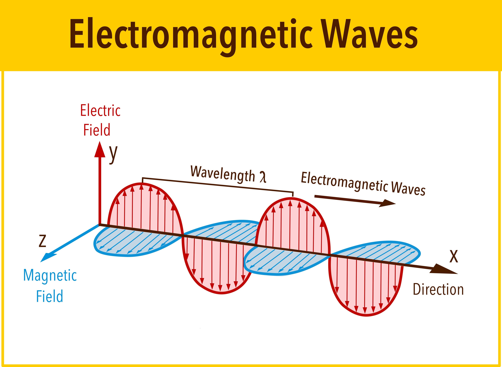

###### This article is intended for educational purposes and summarize the current scientific understating, while this article was made to ensure accuracy, you should not use this as your only source of information.

### What is nothing?

We really do not know what nothing is because we never saw absolute nothing but mathematical models of nothing exist, but still we do not completely understand the concept of nothing, because we only know that every "empty" region on the universe contain quantum fields, because in physics there is no thing as a true void or in other words something that has no energy and matter (nothing). You are now probably thinking that this is some philosophical phrase that does not make sense. But I will explain that concept to you in a second.

### Brief explanation of what vacuum is

In quantum field theory, vacuum is described as the lowest energy state of the field,[[1]](#fn-1), so basically it means that vacuum is not nothing.

### How can vacuum be something if it does not contain any matter?

While perfect vacuum[[2]](#fn-2) does not contain any matter to be considered, (atoms), we consider it as something, because while it does not have atoms it has energy, which means it is something.

But, space vacuum[[3]](#fn-3) is not the same as perfect vacuum, because it has some atoms, they are just extremely far apart from each other.

### Why sound waves do not work on vacuum?

Just as I explained before space vacuum is extremely rarefied, so the atoms are not close enough neither are enough to make sound waves work like on air on earth, because sounds are mechanical waves. So sound waves do not work, and the result of it is not hearing anything while on space vacuum.

On perfect vacuum is even easier to explain, if space vacuum has not atoms close enough to create sound waves, perfect vacuum, the state of field that has no atoms will have the same result no sound.

### Why does light travel through vacuum?

The difference between light and sound travelling through vacuum is one and is not that hard to understand, unlike sound, light does not need a medium to travel. An electromagnetic wave consists of oscillating electric and magnetic fields, and those travel together as a transverse wave, and both allow the light to propagate through vacuum oscillating together.

### Sources :

[Physics Exchange.com](https://physics.stackexchange.com/questions/561720/what-is-meant-by-the-lowest-energy-state-of-an-atom)
[Reddit - AskPhysics](https://www.reddit.com/r/AskPhysics/comments/1ll94js/what_is_a_vacuum_really/)
[Reddit - explainlikeimfive](https://www.reddit.com/r/explainlikeimfive/comments/b8ma01/eli5_how_can_light_travel_in_the_vacuum_of_space/)

### Footnotes:

1. Lowest energy state of the field it is just the state of field with the smallest amount of energy that we know of.[↩︎](#fnref-1)
2. Perfect vacuum is an idealized concept vacuum that does not have any atoms, it only has quantum fields.[↩︎](#fnref-2)
3. Is the vacuum that we find on space, with some atoms and energy.[↩︎](#fnref-3)
